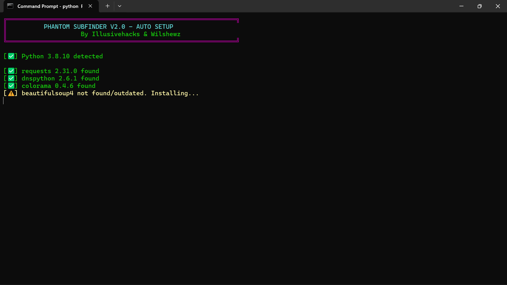
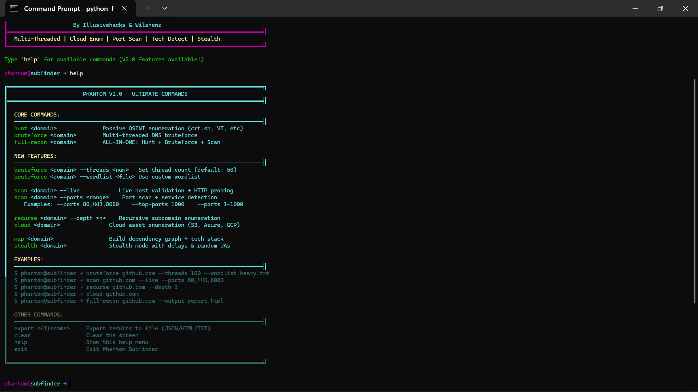

# 👻 Phantom Subfinder V2.0
### Ultimate Subdomain Reconnaissance Tool
**By Illusivehacks & Wilshwez**


> ⚠️ **FOR EDUCATIONAL PURPOSES ONLY** — Only use this tool on domains you own or have **explicit written authorisation** to test. Unauthorised scanning is illegal and may result in criminal prosecution. The authors accept no responsibility for misuse.

---

## 📖 Overview

Phantom Subfinder is an open-source, multi-threaded subdomain enumeration and reconnaissance framework written in Python 3. It aggregates data from numerous passive OSINT sources, performs active DNS brute-forcing, probes live hosts, scans ports, enumerates cloud assets, and maps technology stacks — all from a single interactive shell.

Whether you're a penetration tester, bug bounty hunter, or cybersecurity student, Phantom gives you a powerful all-in-one recon toolkit.

---

## ✨ Features

| Feature | Description |
|---|---|
| 🔍 Passive OSINT | Queries 9+ sources: crt.sh, VirusTotal, ThreatCrowd, HackerTarget, RapidDNS, AlienVault, URLScan.io, SecurityTrails, Censys |
| 💣 DNS Brute-Force | Multi-threaded with configurable thread count and custom wordlists |
| 🌐 Live Host Validation | HTTP/HTTPS probing with status codes, page titles, and server headers |
| 🧠 Tech Fingerprinting | Detects WordPress, Drupal, React, Angular, CloudFront, Azure, and more |
| 🔌 Port Scanning | Banner grabbing and service detection across configurable port ranges |
| ☁️ Cloud Enumeration | Discovers S3 buckets, Azure Blob Storage, and GCP buckets |
| 🔁 Recursive Enumeration | Sub-subdomain hunting up to configurable depth |
| 👁️ Stealth Mode | Randomised user agents and configurable request delays |
| 🗺️ Dependency Mapping | Maps CNAME chains and cross-subdomain relationships |
| 📤 Export | Save results as JSON, HTML dashboard report, or plain TXT |

---

## ⚙️ Requirements

- Python 3.7+
- pip
- Internet connection
- Linux / macOS / Windows 10+

---

## 🚀 Installation
```bash
git clone https://github.com/YOUR_USERNAME/phantom-subfinder.git
cd phantom-subfinder
python3 phantom.py
```

> Phantom automatically installs all required dependencies on first launch. No manual pip install needed.

### Dependencies (auto-installed)

| Package | Purpose |
|---|---|
| requests | HTTP client for OSINT queries |
| dnspython | DNS resolution engine |
| colorama | Cross-platform terminal colours |
| beautifulsoup4 | HTML parsing |
| lxml | Fast XML/HTML parser |
| cryptography | SSL/TLS utilities |
| urllib3 | URL handling and HTTP pooling |

---

## 💻 Usage

### Interactive Mode (recommended)
```bash
python3 phantom.py
```

### Direct Command-Line Mode
```bash
python3 phantom.py -d example.com -m hunt
python3 phantom.py -d example.com -m full -o report.html
```

### CLI Flags
| Flag | Default | Description |
|---|---|---|
| `-d` / `--domain` | None | Target domain |
| `-m` / `--mode` | hunt | `hunt` \| `bruteforce` \| `full` |
| `-o` / `--output` | None | Output file (.json / .html / .txt) |
| `--threads` | 50 | Number of worker threads |
| `--wordlist` | common | `common` \| `heavy` |

---

## 🧰 Commands

Once inside the interactive shell:
```
phantom@subfinder →
```

### `hunt <domain>`
Passive OSINT enumeration — queries all 9 sources without touching the target directly.
```
hunt example.com
```

### `bruteforce <domain> [options]`
Active multi-threaded DNS brute-force.
```
bruteforce example.com --threads 100 --wordlist heavy
bruteforce example.com --wordlist /path/to/custom.txt
```

### `scan <domain> [options]`
Live host validation and port scanning.
```
scan example.com --live
scan example.com --live --ports 80,443,8080,8443
scan example.com --ports 1-1000
scan example.com --top-ports 100
```

### `recurse <domain> --depth <n>`
Recursive subdomain enumeration.
```
recurse example.com --depth 3
```

### `cloud <domain>`
Discover misconfigured or exposed cloud storage buckets.
```
cloud example.com
```

### `map <domain>`
Build a dependency graph between subdomains.
```
map example.com
```

### `stealth <domain> --delay <seconds>`
Low-noise mode with randomised user agents and request delays.
```
stealth example.com --delay 3
```

### `full-recon <domain> --output <file>`
Complete all-in-one recon pipeline (all 6 phases).
```
full-recon example.com --output report.html
```

### `export <filename>`
Export current session results.
```
export results.json
export report.html
export findings.txt
```

---

## 🔄 Typical Workflows

**Quick passive recon:**
```bash
hunt example.com
export passive-results.json
```

**Full authorised pentest:**
```bash
full-recon example.com --output pentest-report.html
```

**Targeted port investigation:**
```bash
hunt example.com
scan example.com --live --ports 22,80,443,3306,8080,8443
```

**Cloud exposure check:**
```bash
cloud example.com
```

---

## 🛠️ Troubleshooting

| Issue | Fix |
|---|---|
| `ModuleNotFoundError` | Run `pip3 install requests dnspython colorama beautifulsoup4` |
| DNS resolution timeouts | Reduce `--threads`; check internet connection |
| No results from OSINT sources | Some sources rate-limit; wait 5 minutes and retry |
| Port scan is slow | Use `--top-ports 100` instead of a full range |
| SSL warnings in output | Expected — Phantom suppresses them automatically |

---

## 📁 Project Structure
```
phantom-subfinder/
├── phantom.py          # Main tool
├── wordlists/
│   ├── common.txt      # ~200 common subdomains (auto-generated)
│   └── heavy.txt       # Extended list with variations (auto-generated)
├── docs/
│   ├── PhantomSubfinder_README.docx
│   ├── PhantomSubfinder_SetupGuide.docx
│   └── PhantomSubfinder_UserGuide.docx
└── README.md
```

---
---

## 🖼️ Screenshots


**Auto installation of Modules**



---


**Tool Banner & Interactive Shell**



---


## ⚖️ Legal & Ethical Use

This software is provided strictly for **educational purposes** and **authorised security testing**. By using Phantom Subfinder you agree to:

- ✅ Only target domains you **own** or have **explicit written permission** to test
- ✅ Comply with all applicable local, national, and international laws
- ✅ Never use this tool to conduct intrusion, DoS, or any illegal attack
- ✅ Take full personal responsibility for how you use this software

Misuse may violate the **Computer Fraud and Abuse Act (CFAA)**, the **UK Computer Misuse Act**, or equivalent legislation in your jurisdiction.

---

## 🤝 Contributing

Pull requests are welcome! Please open an issue first to discuss significant changes. All contributions must include documentation updates.

1. Fork the repo
2. Create your feature branch: `git checkout -b feature/my-feature`
3. Commit your changes: `git commit -m 'Add my feature'`
4. Push to the branch: `git push origin feature/my-feature`
5. Open a Pull Request

---

## 📄 License

Released under the [MIT License](LICENSE).

---

<p align="center">Made with 👻 by Illusivehacks & Wilshewz</p>
